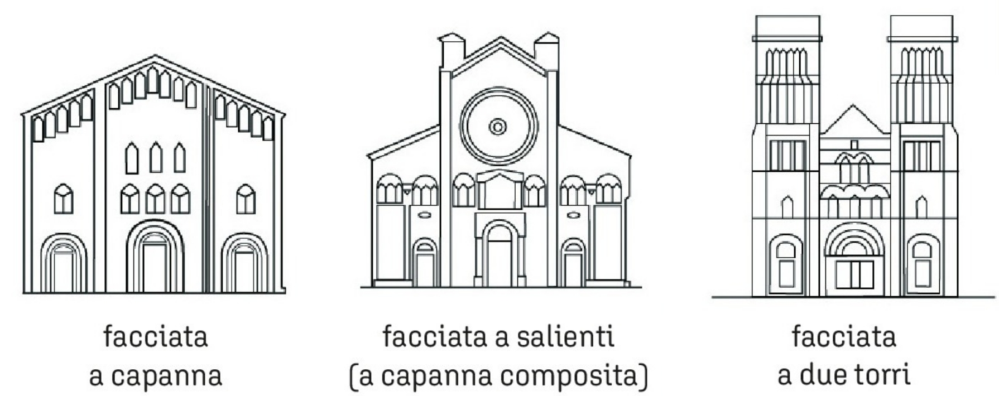

# Arte romanica

## Chiesa romanica

- Rosone
  - finestra circolare sulla facciata

- Presbiterio
  - spazio riservato al clero
- Oculo
  - rosone senza vetro
- Capriata
  - sistema di travi che sostiene le falde del tetto
- Volta
  - spazio di copertura con arco (es ombrello)

##

Elenco chiese da sapere:
- Chiesa romanica sant'ambrogio
- San marco (cupole a bulbo-croce greca con dettagli)
- Campo dei miracoli di Pisa
  - duomo di Pisa (inventa stile di facciata)
    - facciata a salienti ma con dettagli mancanti e aggiunge un colonnato
  - battistero di Pisa
- Battistero di firenze
  - apertura ceca (porta con muro, senza funzione di apertura)
- Basilica di san nicola a Bari
  - archi strutturali nella navata centrale
- 