# Arte
## Gotico
### Introduzione

Gotico in Italia si svilupperà più tardi, perché la moda del momento è il Romanica, il quale parte dall'Italia.

Il termine Gotico nasce da **Giorgio Basari**, un critico d'arte, artista, scultore e sopratutto scrittore. Scriveva le memorie di ogni autore di quel periodo. Giorgio Basari è un rinascimentale, e quando parla dell'arte precedente, ne parla male. Di conseguenza Gotico deriva da **Goti**, che significa **barbaro, rozzo**.

### Primi autori

**Benedetto Antelami** ricorda Willigelmo ed è il **primo scultore gotico italiano**. Antelami fa dei viaggi in Francia e cerca di ricreare le opere.

##

*Deposizione dalla croce*

Blocco centrale: 
- Gesù sta al centro. 
- Giuseppe sta a destra a tenere la mano di Gesù. 
- La persona che lo prende in braccio è Maria. 
- Quello sulla scala è Nicodemo (sta togliendo un chiodo).

A destra:
- stanno i giudei
- L'angelo è raffaello e abbassa la testa ad un giudeo, perché sta davanti a Gesù
- la **luna**

A sinistra:
- stanno i fedeli.
- L'angelo è Gabriele
- il **sole**

I piedi sono sfalsati e le teste sono un po' più inclinate e le vesti hanno più piegature:
(**più realistico rispetto a prima**).

**Alto rilievo**

##

*Maestro dei mesi*

## Architettura Gotica

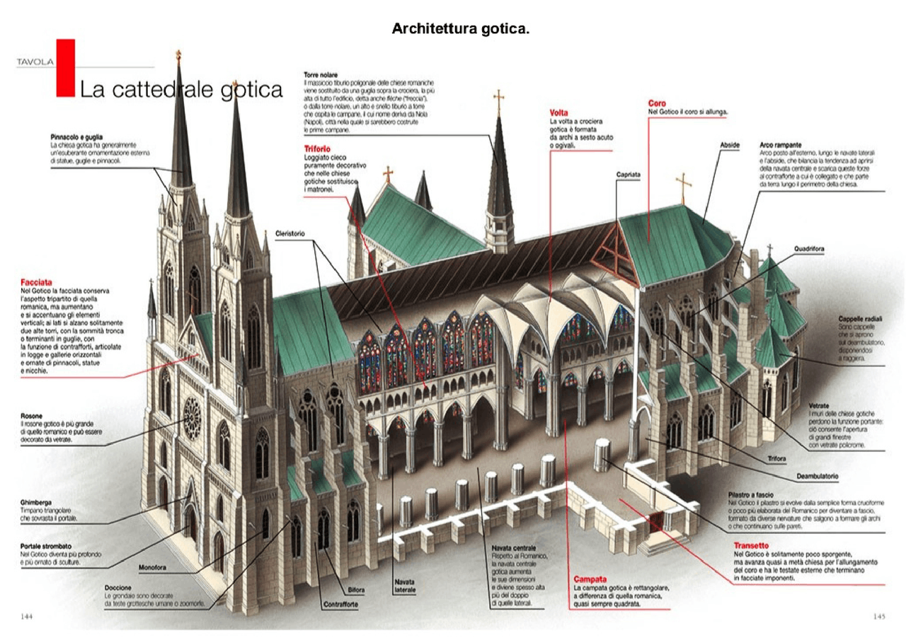

Caratteristiche principali del gotico:
- **Verticalismo**
- **Luce**

Pareti vetrate (navata)

Problemi strutturali = **archi rampanti** che scaricano l'energia in un pezzo di muro sporgente al di fuori della chiesa, chiamato **contrafforte**.

Matroneo si trasforma in **triforio**.
sopra il triforio si aggiungo altre finestre, chiamate **cleristorio**.

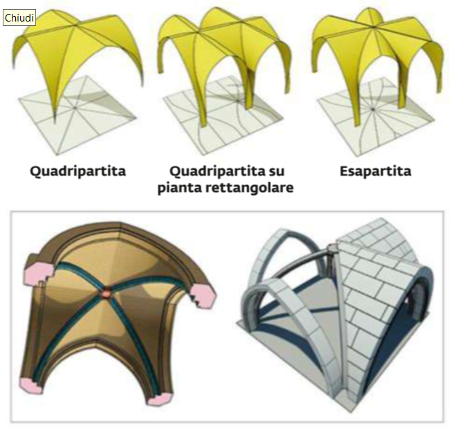

### Arco

L'arco non più a tutto sesto ma a **sesto acuto**, di conseguenza le volte si trasformano in **volte ad ogiva** (prima a crocera (intersezione di due volte a botte ed assomiglia ad una croce)). Quindi ci possono essere Volte a crocera e volte a **crocera ad ogiva**

L'arco a sesto acuto **non dipende più dalla larghezza**, perché non hanno una semi-circonferenza, di conseguenza si possono fare ad altezza e larghezza variabile.

### Guglia e Pinnacolo

- Guglia elemento **decorativo**.
- Pinnacolo elemento **strutturale**.

Porta messa più indietro della facciata

Sopra la porta c'è un elemento decorativo chiamato **Ghimberga**.

**Gargoyle** sono animali mitologici, e nell'architettura gotica vengono messi per far uscire l'acqua alla fine delle grondaie.

*Pianta chiesa gotica*

*Pianta cattedrale di chartres*

**Deambulatorio**: zona per i fedeli ed inventata dall'abate **Suger**.

Prima chiesa gotica: **Chiesa abbaziale di Saint-Denis**. L'abate Suger era incaricato a ristrutturare la chiesa e aggiunge due deambulatori:

- quello interno ha una volta a crocera ogivale
- quello all'esterno ha cinque vele

Inserisce il triforio e il cleristorio, rendendo tutto più luminoso

I pilastri della chiesa hanno dei fasci per sostenere il resto, di conseguenza il pilastro viene chiamato **pilastro a fascio**.

Davanti al deambulatorio (al di fuori) sono presenti **tre cappelle radiali**.

**Cattedrale di chartres** ha due torri **diverse**.

### Cattedrale di Notre-dame di Parigi

Transetto **non sporgente**

Apside semi-circolate

**Coro** zona compresa tra transetto e deambulatorio

Cappelle radiali all'interno del perimetro

- Torri larghe **perdendo** il **senso di verticalismo**.
- Portale strombato
- Ghimberga non presente
- Rosoni ciechi laterali
- Serie di bifore sopra
- Le torri grandi bifore

**Decorazione** soltanto **grafica** (semplice)

- Contrafforti **sottili**

- Altre facciate che stanno sul transetto.
  - Rosone cieco

## Sainte-Chapelle di Parigi

- Non è una chiesa. Tiene la **corona di cristo**
- Facciata strana
- All'interno soltanto una navata chiamata: **aula unica**
- Portale non strombato, perché prima della porta è presente un porticato
- Abside ottagonale

- Illuminazione bassa. **Cupo**
- Molte decorazioni. Soprattutto in **oro** e **blu**
- Tanto vetro. Vetrate alte fino al soffitto

##

Gotico in italia **temperato**

##

### Notre-dame di Strasburgo

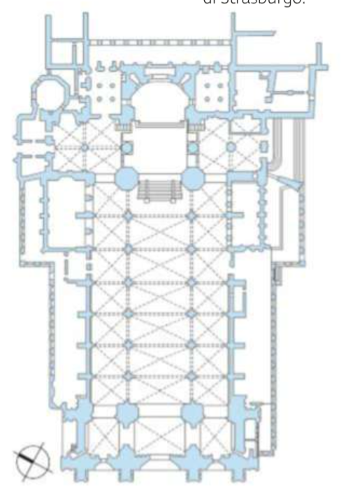

- Suddivisione a 3 navate
- Transetto non particolarmente sporgente

- Archetti davati alle finestre.
- **Contrafforti** nella facciata decorati.
  - Perché navate ampie

### Cattedrale di Canterbury

- **Doppio** transetto
- Coro **prima** del transetto

### Chiesa di Westminster

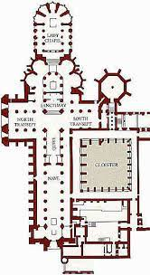

- Volte con tanti elementi. Costoloni a stella, tante intersezioni.

## Gotico in Italia

### Basilica di san Francesco d'Assisi

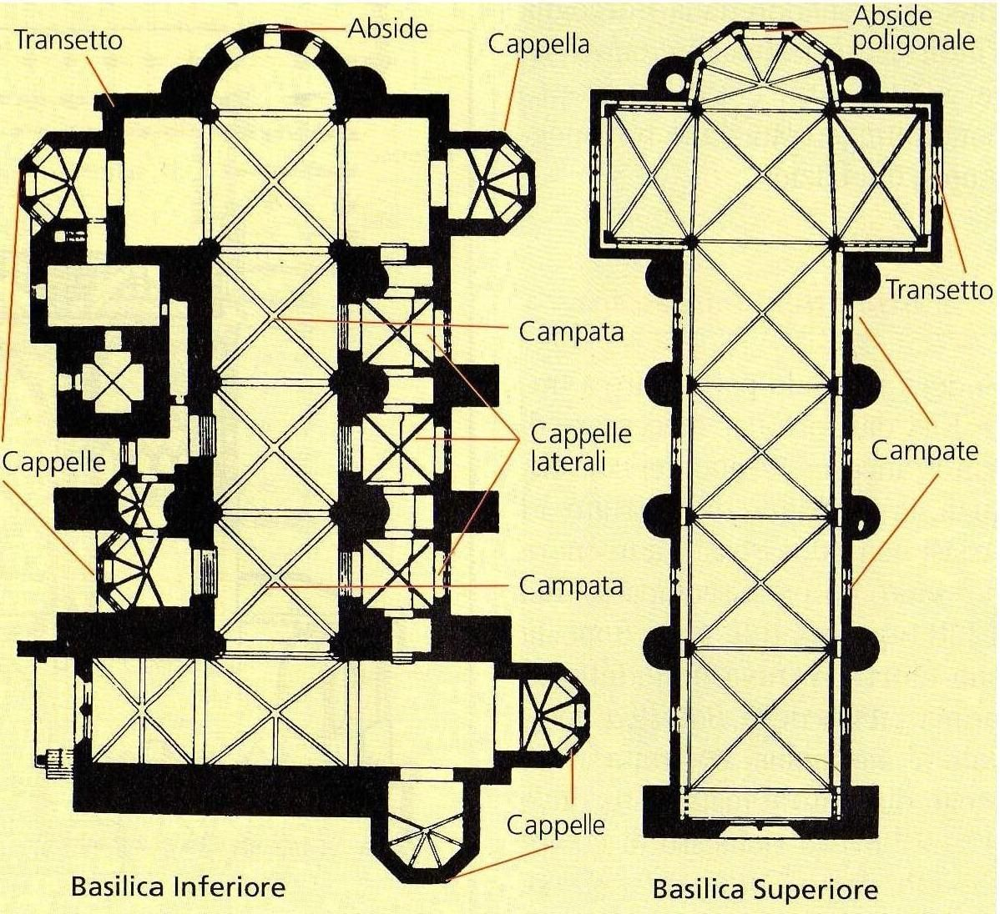

Unisce romanico con gotico. Origne chiesa paleocristiana.

- A **due piani**

Primo piano:
- Entrata **laterale**
  - perché zona collinare e la chiesa si basa su fondamenta di costruzione più antica
- **Navata unica**: aula unica
- Cappella laterale private solo da un lato
- Abside semi-circolare
- **Transetto spazio unico**

Secondo piano:
- Navata unica
- Volte a crociera
- Abside poligonale
- Transetto spazio unico

- **Contrafforti semicircolari**
- Arco rampante dopo contrafforte
  - perché **mancanza di spazio**

- Molto spoglia
- Apertura leggermente strombato
- Decorazioni assenti: romanico

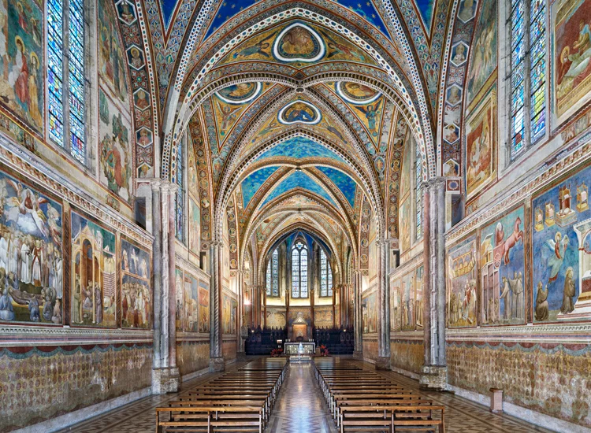

- Tanti dipinti fatti da giotto
  - raccontano la storia di Francesco d'Assisi
  - dipinti perché per raccontare la storia agli analfabeti
- Dipinto sul tetto **danneggiato** dall'ossidazione.

### Basilica del santo a Padova

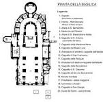

Lavoro di Donatello all'interno

- Altare all'interno

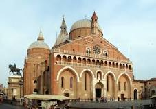

- Loggiato
  - simile duomo di Pisa

### Basilica di santa Maria Novella

### Basilica di santa Croce

Basilica che deriva da una chiesa paleocristiana.

Arti trasversali che che uniscono i pilastri alle pareti delle navate laterali.

### Basilica santa Maria del fiore

Chiesa più importante

Due progetti di ingrandimento.
Il primo (arancione) non è stato finito (Arnolfo di Cambio muore) e il lavoro viene affidato a Francesco Talenti che aumenta le dimensioni
Transetto ha l'estremita "circolari" e la chiesa finisce a **fiore**.

## Abbazia cistercensi

Cistercensi sono monaci molto poveri.

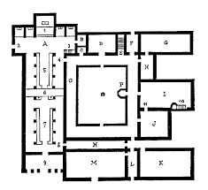

Direzione verso nord perché non batte il sole, quindi per l'inverno muri spessi con aria all'interno.
Unione tra chiesa e diverse stanze per i monaci.
**Sala capitolare** a destra del transetto, **chiostro** al centro (piccolo giardino).

### Abbazia di Fossanova

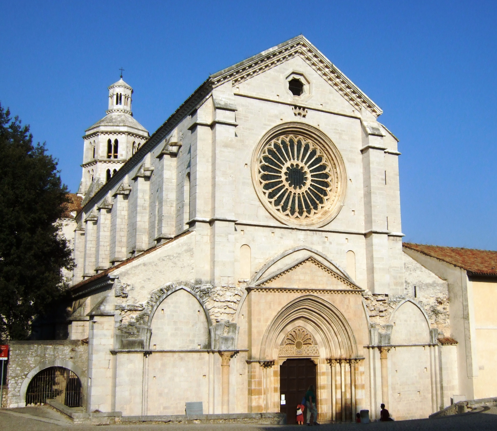

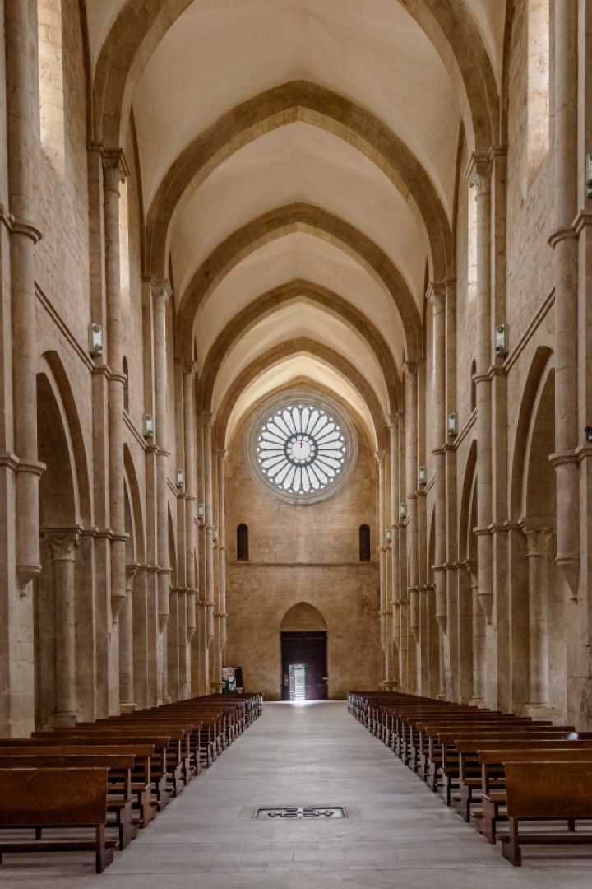

## Federico II di Svevia

Andò al potere molto giovane ed è molto interessato all'arte.
Vuole riportare l'arte degli antichi nella sua città.

### Castel del Monte

Si trova in Puglia.
Residenza ambigua. Non si sa se residenza o una fortezza, perché compattezza della struttura.

Ogni angolo dell'ottagono ha delle torri che sono piene e servono come scale. Stanze a forma trapezioidale.
Ogni stanza a una volta a crociera e le altri parti vengono lasciati a vele singole.

Struttura molto spoglia sopratutto nell'impianto architettonico.

## Scultura

Verrà per la maggior parte saltata.

### Pulpito del battistero di Pisa Nicola Pisano

Archi a tutto sesto **trilobati**. Pilastrini **tristili** agli angoli dell'esagono del pulpito, di cui i lati sono in rilievo in carattere narrativo.

Passettino oltre: richiamo agli antichi, perché i vestiti hanno i **panneggi**, per far capire in che posizione stavano i personaggi e la loro importanza. Citazioni periodo **classico**. Altezza busto e gambe sproporzionate. Cerca di fare uno step successivo.

### Pulpito del duomo di Pisa Giovanni Pisano

A differenza di suo padre, **non segue l'antico**.

Pulpito di forma circolare. Sono presenti le **cariatidi** e danno un illusione di un arco. Capitelli a **croché**. Colonne. Mura più **gonfie** e illusione di perimetro a fiore

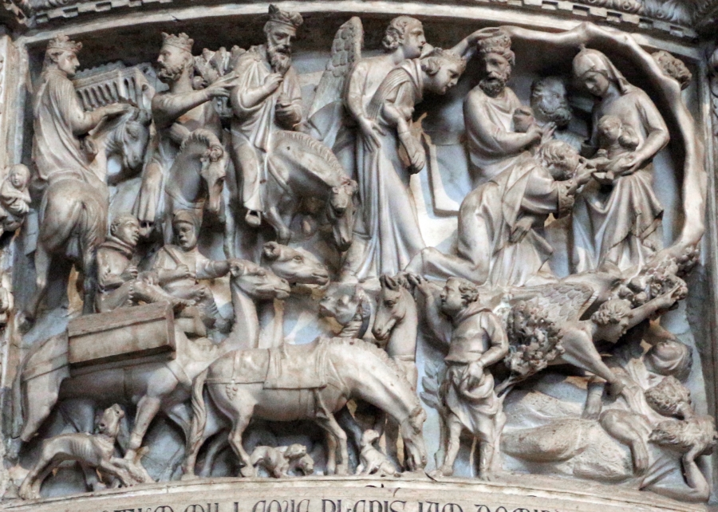

- Sinistra magi che arrivano. 
- A destra sogno dei magi, in cui al centri, gli angeli cercano di svegliare i magi

### Madonna col bambino

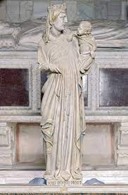

- Bambino appoggiato sulla mano e si guardano, il bambino appoggia il braccio
- La madonna pensa solo al dialogo muto con il bambino

---

### Madonna col bambino di Arnolfo di Cambio

- Più classico con panneggi, ma posizione più rigida
- I soggetti guardano noi

---

Opere da segnare:

Romanico:
- Basilica di sant'Ambrogio a Milano
- Duomo di Modena
- Basilica di san marco
- Battistero di Firenze
- Duomo, torre, battistero di Pisa
- San Nicola di Bari

Gotico:
- Storia Gotico
- Benedetto antelami
- Il portale dei mesi
- Terminologia architettura gotica
- (136 no)
- Sant denis prima chiesa Gotica
- Notre dame di parigi, quella di chartre
- Sant chapelle
- Gotico al di fuori del lil de france
- Notre dame di strasburgo
- cattedrale di Canterbury
- chiesa di westminster
- Inizio gotico italiano temperato (influenzato dal romanico)
- San francesco d'assisi
- Basilica del santo di Padova
- (bologna napoli NO)
- santa maria novella, santa croce, del fiore (Firenze)
- Abbazia cistercense (per spiegare quella di Fossanova)
- Abbazia di Fossanova
- Castel del monte (Federico II)
- (scultura gotica no)
- Pulpito battistero di pisa (Nicola Pisano)
- Pulpito duomo di Pisa (Giovanni Pisano)
- Madonna col bambino (Giovanni Pisano)
- Madonna col bambino (Arnolfo di Cambio)

---
---

## Pittura Gotica

Si sviluppa dal periodo Paleocristiano: 
- assenza di prospettiva
- forme semplici
- si dipinge su **tavola** (di legno) e **miniatura**: 
  - **pala d'altare**
  - **Fondo dorato**
  - **Polittico**: pala d'altare suddivisa in più scomparti.
- pittura su **vetro**
  - si usa un cartone preparatorio per poi dipingere
  - essendo vetro, colori piatti con pigmenti speciali e forme semplici
  - racconti biblici

## Pittura italiana

Due scuole in cui si trasmettono le conoscienze:
- Toscana: grande fortuna successiva per il rinascimento
- Romana: si aggrappa di più all'antico
- (qualcosa di lombardo)

Opere di committenza di tipo religioso

### Bonaventura Berlingheri

#### Pala d'altare per la chiesa di san Francesco

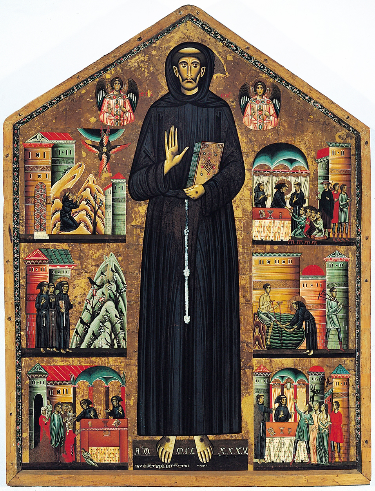

Finestra **timpanata**.
Tipi di finestre:
- finestra **architravata**
- finestra **timpanata**
- finestra **centinata**

Forma pala:
- **Quadrangolare**
- **Cuspide** (san Francesco)
- **Centina**
---
- Fondo dorato
- Rappresentazione **gerarchica**
- Spazio diviso in tre livelli (**tripartito**)
  - vita di san Francesco
- Due angeli in alto
  - esattamente identici
  - a mezzo busto
- **Niente profondità**
  - Figure di sfondo piatte (edifici)
  - Prova a dare profondità facendo delle ombre

### Cima Bue (Cenni Pepo)

Al livello storico, non sappiamo praticamente nulla. Si dice che sia il maestro di Giotto.

Propone qualcosa in più rispetto al suo periodo

#### Crocifissione di San Domenico

- Croce forma latina
  - **Cimasa** nella parta alta rettangolare
  - **Clipeo** cerchio ancora più sopra
- Sinistra e Destra Maria e Giuseppe

Queste aggiunte sono novità

- Espressione Cristo **Patetica** (patetismo)
  - esagerata perché sta soffrendo
- Testa appoggiata alla spalla
- **Anatomia finta**
  - Ombra troppo scura profondità
- Sangue che esce in maniera innaturale
- **Posizione a parentesi del Cristo**
  - per dare illusione che cada
  - ma braccia stanno in orizzontale (rigide)
- Aureola disco piatto
- Piedi separati in direzioni diverse
- **Chiodi**
- Maria e Giuseppe fissano davanti

#### Maestà del Louvre

- Simmetrica
- Niente idea di profondità
  - trono messo in diagonale
    - resto incoerente
- Pigmenti (rosso, blu, grigi)
- Volti uguali (sembrano un po' verdi)
- Madonna sembra appoggiata in avanti
  - vestito con piegature, ma sembra fagottata
- Prospettiva gerarchica

#### Madonna di santa Trinita

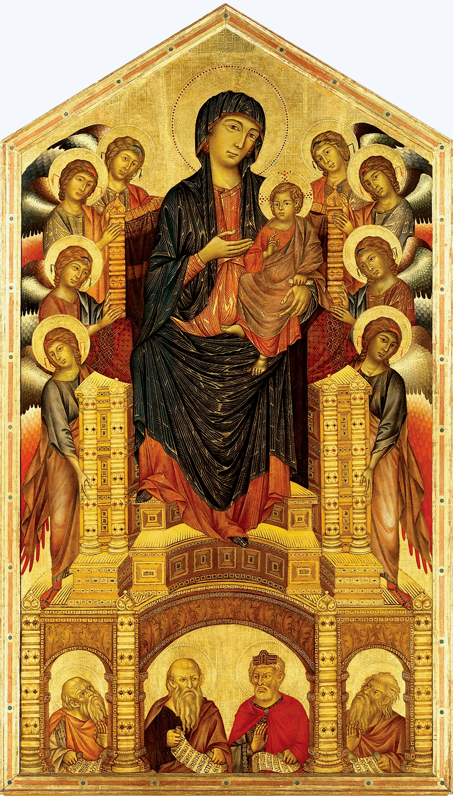

- Niente prospettiva
- quattro profeti
- volume del trono
  - spazialità verticale

#### Ciclo di Assisi

- Pittura un po' rovinata
  - intonaco staccato (lavorazione su parete)
- sfondo blu e figure bianche
  - colori si sono invertiti col tempo
    - grande lavoro di restauro
- Sinistra gesuiti
- Destra tutti gli altri
- Gesti esagerati (patetismo) (dolore)
  - perché mancanza di espressione nei visi
- crocifissione di gesù
  - sinistra madonna ? 
  - destra giuseppe ?
- simmetrica ?

### Duccio di Buoninsegna

(poco o niente)

Scuola di Siena ed ha lavorato per le confraternite religiose, tra cui la più importante di Siena.

#### Madonna Rucellai

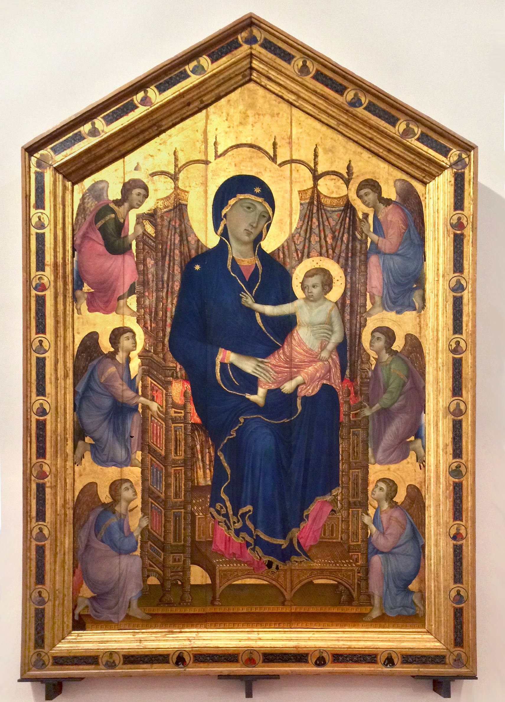

- si copre lo schienale del trono
- angeli rannicchiti
- madonna e bambino
  - non sembrano seduti
    - solo ginocchio della madonna

#### Pala della maestà di Siena

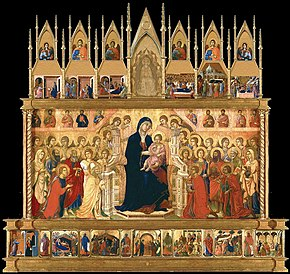

- Davanti
  - file di persone in base all'altezza
  - dimensione madonna
    - sproporzionata, molto grande
  - una fila di persone dietro
    - perché molto lontane
  - panneggi più morbidi
  - parte sotto si chiama **predella**
    - aggiungono pezzi di storia

- Dietro
  - quadratini di racconti (**formelle**)
    - quella più grande crocifissione
    - sfondo dorato
    - coerenza mettere vicini formelle
      - caratteristica di una formella si avvicina a quelle a fianco

