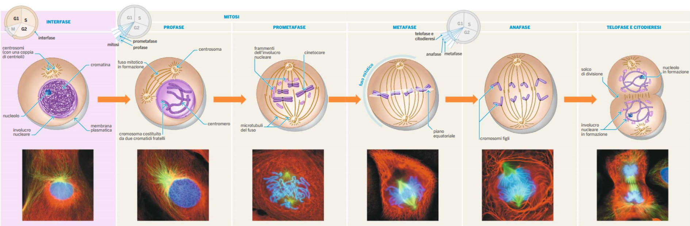
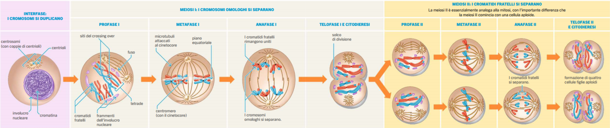

# Biologia

## Ciclo Cellulare

Il **ciclo cellulare** è l'insieme di eventi tra una divisione cellulare e un'altra, tra cellule **diploide** (2n (es 2*23)), cioè coppie di cromosomi omologhi (corredo cromosomico completo).

La cellula passa la maggiorparte del tempo in **interfase** (90% del tempo), durante la quale l'attività metabolica della cellula è molto elevata: sintetizza una grande quantità di proteine e fabbrica nuovi organuli.
Successivamente passa in **mitosi**, in cui la cellula effettivamente si divide.

### Interfase

L'interfase è composto da tre sottofasi:
- la sottofase **G1**
  - sintesi di RNA e proteine. _Accrescimento_
- la sottofase **S**
  - sintesi del DNA e duplicazione dei cromosomi. _Duplicazione del DNA_
- la sottofase **G2**
  - sintesi di proteine. _Preparazione alla divisione cellulare_

### Fase Mitotica

La Fase M è composta in due stadi:
- **Mitosi**
  - in cui nucleo e contenuto genetico si duplicano e si distribuiscono in modo equilbrato ai poli opposti della cellula, per formare i due nuovi nuclei.
- **Citodieresi**
  - in cui il citoplasma si divide in due.

##

Per capire se una cellula non è anomala, sono presenti **tre punti di blocco** nel ciclo:
- Fine fase G1
  - Si controlla se ci sono abbastanza nutrienti e se il volume cellulare è sufficiente.
- Fine fase G2
  - Si controlla se la cellula è abbastanza grande e se il DNA si è duplicato correttamente.
- Fine fase M
  - Si controlla se la mitosi avviene correttamente.

Come si presenta il DNA durante il ciclo:
- G1: filamento singolo. _Cromatina_
- S e G2: incomincia a compattarsi. _Cromatina_
- M: creazione cromosomi (DNA molto compattato). _Cromosomi_

Ogni filamento viene duplicato. Nella forma di cromosoma, vi sono due filamenti. Il filamento compattato all'interno del cromosoma, si chiama **cromatide fratello**.
Il punto di contatto dei cromatidi fratelli all'interno del cromosoma si chiama **centromero**.

## Mitosi

è composta in più fasi:
- **Profase**
  - La membrana nucleare si disgrega
  - I cromosomi si compattano
  - Si comincia a formare il **fuso mitotico**
    - struttura proteica creata dai centrioli per tenere agganciati i cromosomi

- **Prometafase**
  - L'involucro nucleare si disgrega completamente
  - Il fuso mitotico si completa
  - I cromosomi si attaccano alle fibre del fuso

- **Metafase**
  - I cromosomi si allineano sul piano equatoriale e formano la **Piastra Metafasica**

- **Anafase**
  - I cromatidi fratelli si separano 
  - Le fibre del fuso si accorciano, trascinando ciascun cromatidio a un polo
  - Ora ciascun cromatidio è un cromosoma

- **Telofase**
  - Il fuso si dissolve
  - Si formano i due involucri nucleari
  - I cromosomi si despiralizzano (diventano di nuovo filamentosi)

## Meiosi

Quando l'uomo entra in pubertà, il corpo sviluppa un ciclo cellulare nuovo: la meiosi.

Questo ciclo cellulare, serve per creare **cellule per la riproduzione**.

L'uomo ha una pubertà ritardata rispetto alla donna, perché nella preistoria, la donna doveva partorire il prima possibile e l'uomo doveva cacciare il prima possibile.

Le **cellule** coinvolte sono **specializzate** e sono all'interno di organi specifici: **testicoli** (maschi) e **ovaie** (femmine).

I maschi possono produrre spermatozoi teoricamente per tutta la vita. Le femmine anche, ma oltre una certa età non è possibile fare figli dal punto di vista fisiologico.

Meiosi inizia con una mitosi all'interno dei **tuboli seminiferi**, in cui una delle due cellule inizia la meiosi e l'altra continua duplicarsi tramite la mitosi.

Differenza tra mitosi e meiosi:

2n = diploide
n = aploide

Mitosi --> 2n --> 2 * 2n

Meiosi --> 2n --> 4 * n

Prima della meiosi **duplicazione** **centrioli**, per creare i centrosomi, e la duplicazione del **DNA**.

Nella meiosi da una cellula diploide si formano **4 cellule aploidi diverse tra loro**, perché nel processo c'è una **ridistribuzione** del corredo genetico (?) e avviene il **crossing-over**.

Il crossing-over **aumenta** solo **la variabilità**.

Cellula iniziale A1B1

Fasi meiosi:

- **Profase**: A1*A1B1*B1
  - Si dividono i cromosomi, i cromosomi **omologhi** si uniscono (tenuti dai centromeri) formando una struttura chiamata **tetrade**, in cui luogo fisico in sono uniti si chiamano **chiamsi** (punti di mezzo). Questo processo, viene chiamato **sinapsi**. In più, avviene il **crossing-over**, pezzi di geni si scambiano di posto.
  - Si crea il fuso meiotico.

- **Metafase**:
  - Le fibre del fuso si attaccano ai cromosomi, che sono nella piastra metafasica, tramite i **cinetocori**.
  - Le fibre del fuso dividono le coppie di cromosomi omologhi. 
  - Avviene controllo se tutti i cromosomi sono allineati.

- **Anafase**:
  - Cromosomi omologhi si separano e si spostano verso il polo del fuso.

- **Telofase**:
  - Riorganizzazione degli organuli e cromosomi si despiralizzano.
  - Forma ovoidale

- **Citodieresi**:
  - La cellula si divide grazie all'azione dei filamenti di actina e miosina che si agganciano da una parte all'altra della membrana plasmatica, dividendo il citoplasma.
