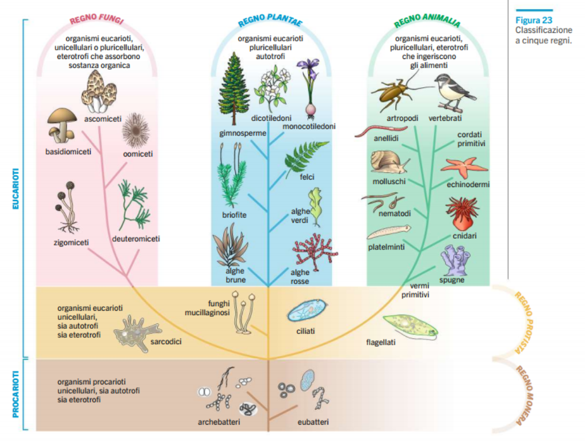
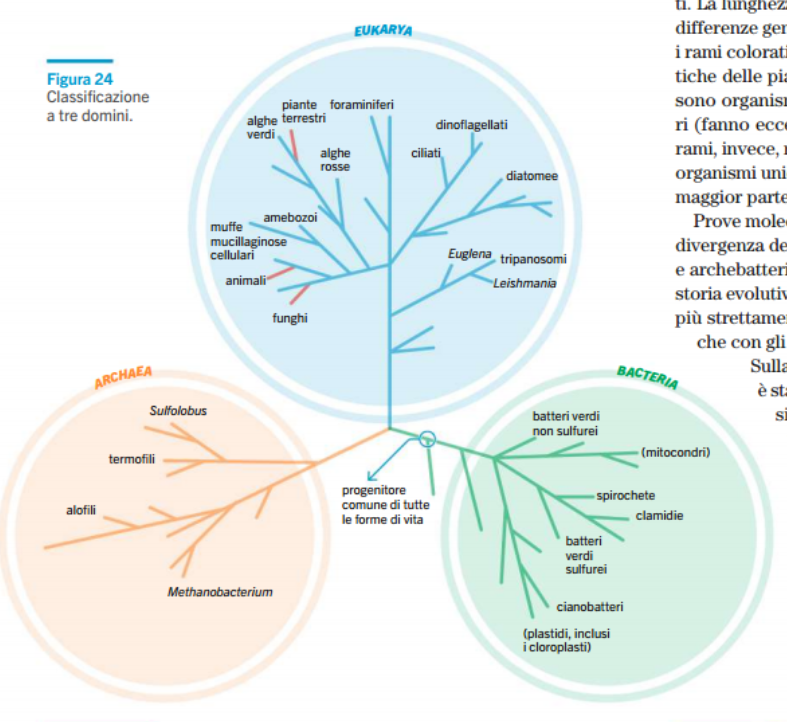

# Biologia
## Formazione vita sulla terra
### Origine Terra e sistema solare

Sistema solare ha avuto origine circa 4.6 miliardi di anni fa insieme alla terra, il quale si può definire come pianeta roccioso.

### Origine vita

La vita ha avuto origine circa 3.5 miliardi di anni fa.

Diverse ipotesi formazione vita, le più importanti:
1. **Esperimento di Miller**
    - Simula l'atmosfera primordiale della terra composta da vapore acqueo, metano, ammoniaca e idrogeno all'interno di un pallone
    - si venne a formare un **brodo primordiale** composto da molecole biologiche semplici.
      - ma passaggio alla vita molto lunga
      - perché la **vita** è composta da molecole biologiche **organizzate** in sistemi complessi.
    - **la vita si è formata con molecole formate sulla terra**
2. **La vita si è formata con molecole provenienti dallo spazio**
    - grazie a comete e asteroidi

### Formazione della vita

Divisione temporale formazione della vita sulla terra:
- **Eone adeano** (primo miliardo)
  - La vita non si è ancora formata
- **Eone archeano**
  - Niente ossigeno atmosferico
  - Prime cellule procariote
    - Non hanno bisogno di ossigeno
- **Eone proterozoico**
  - Alcune cellule procarioti acquisiscono la funzione della fotosintesi clorofiliana
    - Comparsa ossigeno atmosferico
  - Comparsa cellule eucarioti
  - Comparsa primi complessi pluricellulari composto da eucarioti
- **Eone fanerozoico**
  - Formazione di vita complessa

### Formazione ossigeno atmosferico

Ossigeno serve per raccogliere l'idrogeno nel processo di formazione dell'ATP, quindi è carburante per i mitocondri. Di conseguenza non fondamentale alla vita.

Le prime cellule procarioti e le cellule che si trovano in fondo all'oceano atlantico, usano lo **zolfo al posto dell'ossigeno**.

---

### Esplosione del cambriano/Biological Big Bang (600 milioni di anni fa)

Divisione periodo in due:
- Precambriano
  - forme di vita unicellulari e invertebrati dal corpo molle
- postcambriano
  - esplosione di nuove forme di vita ("nuova creazione") (esplosione del cambriano)

### Fossili

Le prove sono i **fossili**, che sono qualunque testimonianza del passato. è composto da esseri viventi intrappolati in rocce (anche con altri materiali: es ambra, ghiaccio), i quali si **litificano** (pietrificazione). Il processo è molto lento.

**Coproliti**: fossili di feci.

**Datazione** fossili grazie allo studio dell'**isotopo radioattivo carbonio 14**
- quando l'organismo vive: carbonio 12 e 14 rapporto costante
- quando l'organismo muore:
  - carbonio 12 rimane costante
  - carbonio 14 comincia a decadere
    - dopo 5730 anni (**tempo di dimezzamento**), la quantità si dimezza

Metodo accurato.

---

### Deriva dei continenti

Per capire deriva dei continenti, bisogna sapere la composizione

Composizione Terra:
- **Litosfera** (SiAl solido)
  - Crosta terreste
  - Mantello superiore (solido con un po' di Mg)
- **Astenosfera** (SiMa (Mg ma per leggerlo meglio) liquido)
  - Mantello intermedio
- **Mantello inferiore** (SiMa solido)
- **Nucleo**
  - **esterno** (NiFe liquido)
  - **interno** (NiFe + Ca solido)

Strato solido/liquido dipende dalla **pressione e temperatura**.

Granito:
- Quarzo (SiO2)
- Plagioclasio (SiAlCaK)
- Miche
  - Biotite (SiAlFeK)

---

I continenti si sono uniti 3 volte (solo era del fanerozoico, perché non ci sono dati)
- Fine era paleozoica
  - **Pangea**
- in mezzo all'era mesozoica
- inizio era cenozoica

Problema deriva dei continenti analizzato da Wegener. Molti animali e fossili presenti sia in sud America che in Africa.

Come si fanno a muovere i contentinenti? Wegener non sa dare una risposta

Nella WW2 Scoperta della dorsale medio-atlantica da parte dei sottomarini, che parte dall'islanda.
- Islanda parte emersa
  - velocità espansione dorsale medio-atlantica diverse: discorso velocità (velocità angolare uguale, velocità lineare diversa)

Più dorsali oceaniche

**Si muovono grazie all'astenosfera**

Da deriva dei continenti alla **tettonica a placche** (domanda a prof: perché la deriva dei continenti non corretta)
- Movimento dei continenti su un qualcosa, (come delle zattere), domanda: su cosa si muovono e la forza che le muove. Contributo per le teorie di adesso: spostamento materia come acqua che bolle nel mantello e anche forza centrifuga (wegner)

---
---
---
---

## Pensieri sull'origine delle specie

- Anassimandro
  - originati dall'acqua e terra riscaldate
- Democrito e (Epicuro)
  - **teoria atomistica**
- Lucrezio
- Aristotele
  - **Idea del fissismo**
    - piramide della natura: uomo al di sopra di tutto.
    - ma le specie rimangono fisse
- Linneo 
  - tesi sul fissismo, ma creo la **nomenclatura** per classificare piante e animali.
- Buffon
  - anni della terra 75000 non 6000 come la bibbia
  - penso anche parentela uomo scimmia (non divulgata)
- Erasmus Darwin (nonno)
  - varietà specie deriva da modificazione di un **filamento vivente**
- Hutton
  - **principio dell'attualismo**
    - processi di modellamento della terra li stessi del passato
    - studia rocci/fossili
      - più in profondità, più antichi sono
- Cuvier
  - **teoria del catasfrofismo**
    - fossili sono organismi morti da **catastrofi**, e quelle più sopra sono organismi nuovi.
- Lamarck
  - studia le **giraffe**
  - continuo **uso del collo**, aumenta lunghezza
    - passato da generezione a generazione (cosa non vera)

## Teoria dell'evoluzione di Darwin

- Darwin studia a Cambridge per carriera ecclesiastica. Per non pagarsi gli studi
- Viaggia per il mondo. Arriva alle Galapagos
  - nota franguelli di due isole con becchi diversi
- Teoria rivoluzionaria, per cui Darwin mostra la sua teoria nei suoi ultimi anni di vita.
  - Contro la chiesa, ma lei fondamenta civiltà civile 
- Wallace teoria quasi identica a quella di Darwin
  - cacciava coleotteri per venderli
  - chiese a Darwin cosa ne pensa
  - successivamente con il suo aiuto pubblica le sue idee
- Darwin pubblica la sua opera più importante
  - **l'origine delle specie per selezione naturale**
    - rimangono in vita solo gli individui che possono rimanere in vita in base all'ecosistema
- Teoria grazie allo studio del suo pollame e sullo scritto dell'economista Thomas Malthus
  - malattie, carestie e guerre
    - per risorse inferiori rispetto alla popolazione
  - soppravvivono solo quelli più adatti/forti

### Selezione naturale:

- si basa sul cambiamento dell'ecosistema delle specie
- **tratti migliori** comportano:
  - maggiore soppravvivenza
  - maggiore prole
    - diventano comuni
- definiti **adattamenti**

Se il cambiamento è di grande portata, comporta **l'estinzione** delle specie che non riescono a soppravvivere nel nuovo ambiente.

### Selezione artificiale

L'uomo apporta la **selezione artificiale** modificando diverse specie, facendo riprodurre solo gli individui in possesso di caratteristiche desiderate.

Es: senape selvatica, OGM (modifica ottenuta cambiando direttamente il DNA)

---

### Dimostrazione teoria

(pag 154-5)

Diverse dimostrazioni:
- distribuzione geografica
  - osservazioni geografiche (**biogeografia**)
  - somiglianza in base alla posizione
- omologie anatomiche
  - somiglianza anatomica: antenato in comune (**omologia**)
    - **strutture omologhe**
  - somiglianza embriologica
  - organi vestigiali
    - parti una volta importanti, ma poi diventati inutili
- omologie molecolari
  - omologie nelle seguenze del DNA

## Filogenesi

Studio dei vari **cladi** (rami genealogico). ll loro insieme si chiama **albero filogenetico** o **cladiogramma**.

Però somiglianza non vuol dire che gli aspetti simili siano ereditati da un antenato comune. Nel processo di **evoluzione convergente**, specie di rami diversi, possono avere le stesse caratteristiche, perché vivono nello stesso ambiente, quindi stessa selezione naturale. Questa somiglianza si chiama **analogia**.

Definizione specie:
- prima definizione
  - tipo (latino) basato sull'aspetto
- **definizione biologica**
  - gruppo in cui i membri hanno la possibilità di riprodursi
    - **isolamento riproduttivo**
- altre definizioni per dimostrare (pk: chiedere alla prof) le classificazioni
  - definizione morfologica di specie
    - identifica in base caratteristiche osservabili e misurabili
  - definizione ecologica di specie
    - identifica in base al ruolo all'interno dell'ecosistema
  - **definizione filogenetica**
    - identifica in base alla sua storia evolutiva
    - specie più piccolo dei gruppi che condivide un antenato in comune

### Nomenclatura e classificazione

Sistematica si occupa di classificare gli organismi.

Binomia: usa due nomi.
- Il primo indica il genere
- Il secondo indica la specie

Classificazione gerarchica (es gatto):
- Specie (Felis catus)
- Genere (Felis)
- Famiglia (Felidae)
- Ordine (Carnivora)
- Classe (Mammalia)
- Phylum (Chordata (colonna vertebrale))
- Regno (Animalia)
- Dominio (Eukarya)

### Albero della vita

Primo modello solo a due regni (di Linneo), con aggiunta di altri 3 regni:
- eucarioti
  - **regno delle piante**
  - **regno degli animali**
  - **regno dei funghi**
  - **regno protista**
- procarioti
  - **regno monista**

Altri studi molecolari hanno suggerito un altro sistema a tre domini:
- dominio eucariote
  - **eukarya**
    - insieme delle forme eucarioti pluricellulari/unicellulari
- domini procarioti
  - **archea**
    - vivono in condizioni estreme
    - altre sostanze organiche
  - **bacteria**
    - mantengono l'assetto del progenitore

---

## Procarioti

- Da 1 a 10 micrometri (eucarioti 10-100).
- Notevole impatto nel mondo
  - si trovano ovunque
- Competizione tra di loro

Tipi di forme (morfologia):
- **Cocchi**
  - forma sferica
  - in catene: **streptococchi**
  - in ammassi: stafilococchi
- **Bacilli**
  - forma di bastoncello
  - a coppie: diplobacilli
  - in catene: streptobacilli
- Categoria ricurva-spirale
  - vibrioni: a virgola
  - spirilli: elicoidale (cavatappi), corto e rigido
  - spirochete: stesso ma più lungo e flessibile

### Nutrimento

Fonti di energia:
- Luce solare
- Energia immagazzinata in molecole organiche
- Energia immagazzinata in molecole inorganiche
  - come H2S, S, composti del ferro e ammoniaca (NH3)

Fonti di carbonio:
- CO2
- Composti organici

#### Tipologie

- Fotoautotrofi (es **cianobatteri**)
  - energia solare
  - CO2
- Chemioautotrofi
  - sostanze inorganiche
  - CO2
- Fotoeterotrofi
  - energia solare
  - composti organici
- Chemioeterotrofi (più diffusi e diversificato)
  - energia da composti organici
  - CO2 e composti organici

### Grande capacità di adattamento

In alcuni procarioti, oltre il DNA, hanno dei DNA più piccoli in forma circolare, chiamati **plasmidi**.

I plasmidi permettono ai batteri di adattarsi rapidamente ai cambiamenti ambientali.

I plasmidi vengono scambiati tra i batteri grazie ad alcuni pili specializzati (pili sessuali). Questo scambio avviene grazie ad un plasmide (quindi non tutti i batteri possono farlo).

### Velocità di riproduzione

Riproduzione veloce (1-3 ore), alcuni anche in 20 min.

Alcuni batteri, se condizioni sono avverse, formano le **endospore**, che sono cellule molto resistenti che possono rimanere quiescenti per molto tempo, disidratate e protette da un robusto rivestimento.

---

### Archebatteri ed Eubatteri

Differenza archebatteri e eubatteri:
- differenza parete cellulare
  - quella degli eubatteri contiene **peptidoglicano**
    - polimeri di zuccheri e catene polipeptidiche
    - mezzo di comunicazione/informazione

Ulteriore differenza usando la **colorazione di Gram**:
- gram-positivi
  - colorazione blu-violetto
  - parete più semplice
- gram-negativi
  - colorazione rossa
  - parete più complessa

Tipi di eubatteri:
- Cianobatteri
  - fotosintesi
- Clamidie
  - vivono all'interno di cellule eucarioti come **parassita**
- Proteobatteri
  - batteri azotofissatori
  - solfobatteri
  - **batteri che vivono negli apparati digerenti**
    - es escherichia coli
- Spirochete
  - alcuni noti come agenti patogeni
    - uno provoca sifilide
- Batteri gram-positivi
  - comprende attinomiceti

Archeobatteri: principalmente estremofili

### Malattia batteriche

Tutti gli organismi esposti da batteri patogeni.

Gran parte delle malattia batteriche sono dovute dalla produzione di sostanze tossiche: **tossine**, che interferiscono con il normale funzionamento delle cellule.

Es:
- Staphyloccus areus
  - innocuo fuori (presente nella pelle e nel naso)
  - altrimenti tossine: **sindrome da shock tossico**
- Clostridium tetani
  - produce tossina che comporta il **tetano**
  - contrazione muscoli
- Clostridium botulinum
  - produce il **botulino**
  - paralisi muscoli
- Neisseria meningitidis
  - produce tossina che causa la **meningite**
- Salmonella (diverse specie)
  - tossine letali
- Gonorrea

Prevenzione:
- strumento più potente: **vaccino**
- preservativo
- precauzioni igeniche

---

## Protisti

Appartengono al gruppo degli eucarioti

Ricavano il nutrimento in vari modi:
- Autotrofi: nutrimento dalla fotosintesi
  - es alghe
- Protozoi: eterotrofi si nutrono di batteri e altri protisti
  - alcuni parassiti (a spese di altri organismi)
- Mixotrofi: sia eterotrofi che autotrofi

Più complessi dei procarioti. Es hanno il nucleo

Formazione dei protisti grazie a due processi:
- **Endosimbiosi primaria**
  - piccoli procarioti all'interno di quelli più grandi (eucarioti autotrofi)
- **Endosimbiosi secondaria**
  - questi eucarioti successivamente diventano **endosimbionti** e vengono inglobati da altri eucarioti eterotrofi

Tanti tipi di protisti:
- (elenco)

---

Dubbio comunità scientifica alghe nei protisti.
- chi dice protisti
- chi dice piante

Perché hanno caratteristiche sia dei protisti che piante.

