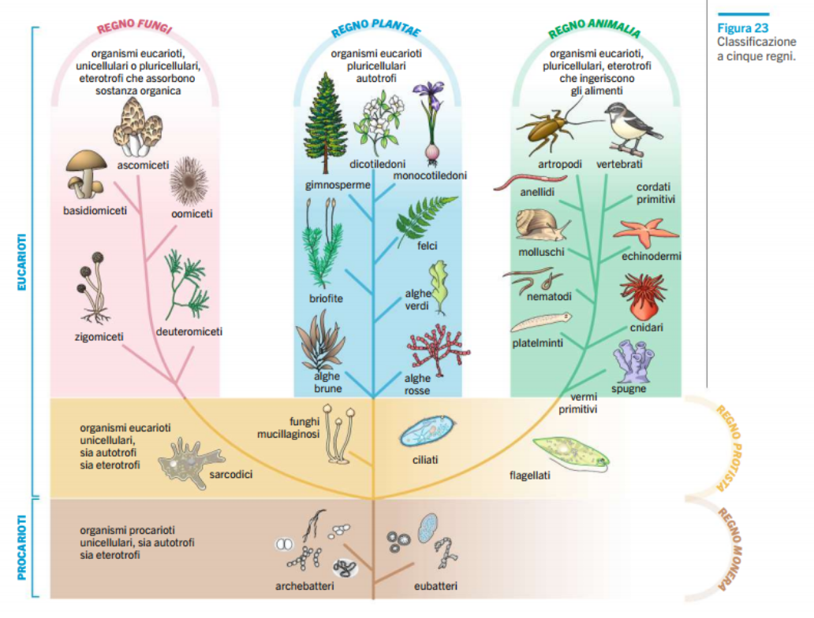
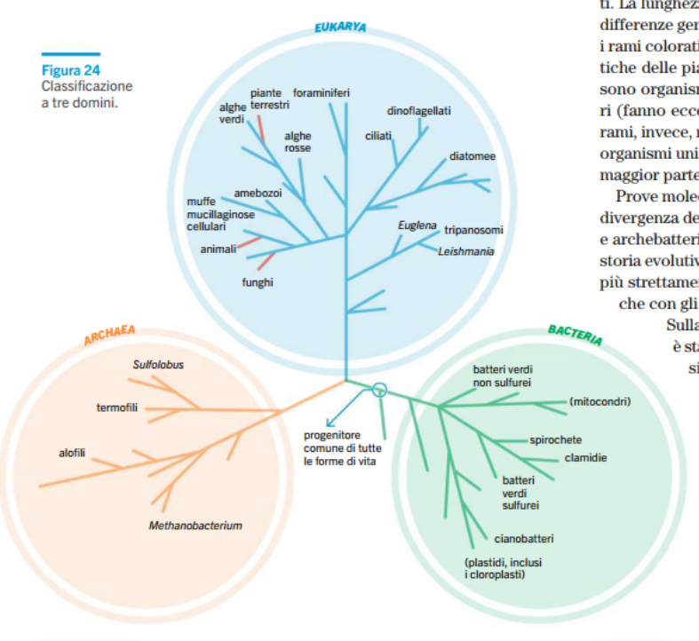

# Biologia
## Filogenesi

Studio dei vari **cladi** (rami genealogico). ll loro insieme si chiama **albero filogenetico** o **cladiogramma**.

Però somiglianza non vuol dire che gli aspetti simili siano ereditati da un antenato comune. Nel processo di **evoluzione convergente**, specie di rami diversi, possono avere le stesse caratteristiche, perché vivono nello stesso ambiente, quindi stessa selezione naturale. Questa somiglianza si chiama **analogia**.

Definizione specie:
- prima definizione
  - tipo (latino) basato sull'aspetto
- **definizione biologica**
  - gruppo in cui i membri hanno la possibilità di riprodursi
    - **isolamento riproduttivo**
- altre definizioni per dimostrare (pk: chiedere alla prof) le classificazioni
  - definizione morfologica di specie
    - identifica in base caratteristiche osservabili e misurabili
  - definizione ecologica di specie
    - identifica in base al ruolo all'interno dell'ecosistema
  - **definizione filogenetica**
    - identifica in base alla sua storia evolutiva
    - specie più piccolo dei gruppi che condivide un antenato in comune

### Nomenclatura e classificazione

Sistematica si occupa di classificare gli organismi.

Binomia: usa due nomi.
- Il primo indica il genere
- Il secondo indica la specie

Classificazione gerarchica (es gatto):
- Specie (Felis catus)
- Genere (Felis)
- Famiglia (Felidae)
- Ordine (Carnivora)
- Classe (Mammalia)
- Phylum (Chordata (colonna vertebrale))
- Regno (Animalia)
- Dominio (Eukarya)

### Albero della vita

Primo modello solo a due regni (di Linneo), con aggiunta di altri 3 regni:
- eucarioti
  - **regno delle piante**
  - **regno degli animali**
  - **regno dei funghi**
  - **regno protista**
- procarioti
  - **regno monista**

Altri studi molecolari hanno suggerito un altro sistema a tre domini:
- dominio eucariote
  - **eukarya**
    - insieme delle forme eucarioti pluricellulari/unicellulari
- domini procarioti
  - **archea**
    - vivono in condizioni estreme
    - altre sostanze organiche
  - **bacteria**
    - mantengono l'assetto del progenitore

