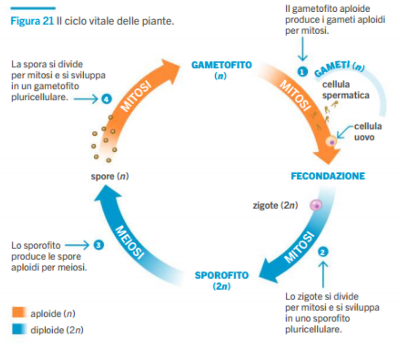
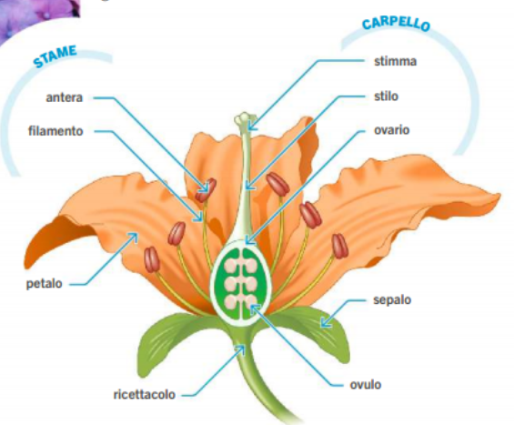
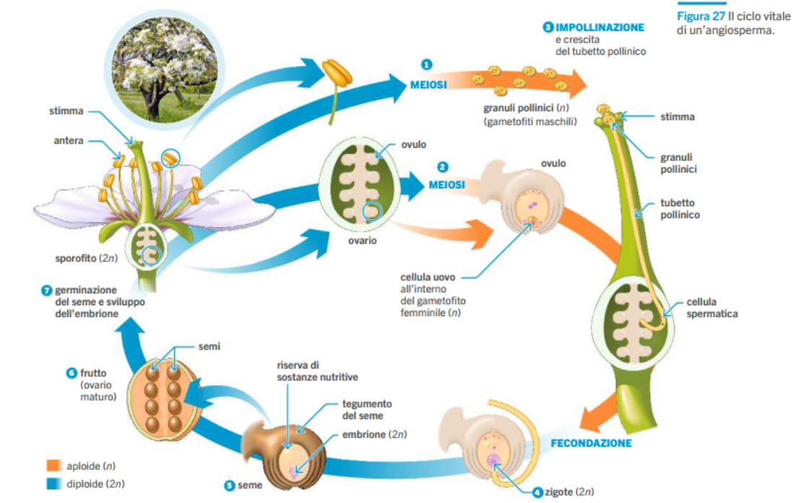

# Biologia
## Piante

- organismi pluricellulari
- organismi terresti
- sezioni
  - radici
  - fusti
  - apparato fogliare
- esistono da 500 milioni di anni
  - si sono dovuti adeguare ad sistema diverso da quello marittimo
    - aria al posto dell'acqua
    - percentuale CO2 diversa da quella dell'aria

### Problema acqua e assorbimento sostanze

- protezione da disidratazione
  - cuticola (sopra le foglie)
    - cera
  - stomi (sotto le foglie)
    - pori che si chiudono
- radici
  - assorbono acqua
  - sostegno
- foglie
  - assorbono CO2
  - fotosintesi
- trasporto per **capillarità**, **coesione** (legami ad idrogeno), **adesione**, **pompaggio** (stomi)
  - **xilema**
    - cellule morte
    - tubicini microscopici
    - acqua e sali salgono per capillarità
  - **floema**
    - cellule vive
    - distribuiscono gli zuccheri

### Storia evolutiva

- piante terresti non vascolari (475 millioni anni fa)
- piante terresti vascolari (425)
- piante con semi (360)
  - semi --> embrioni
  - seme "coperto"
  - seme nudo
- piante con fiori

### Riproduzione in base al tipo

- piante non vascolari (muschi)
  - usano l'acqua per trasportare i gameti
- piante vascolari senza semi
  - usano l'aria per trasportare i gameti
  - gameti racchiusi in **spore**

### Ciclo vitale delle piante

(pag 181)

Per le piante non vascolari/vascolari:
- si parte dal gametofito (n) (pianta di partenza)
  - crea per mitosi cellule spermatiche (gametofito maschile) e cellule uovo (gametofito femminile)
- avviene la fecondazione (cellula zigote)
  - per mitosi cresce
- si crea lo sporofito (2n)
  - pianta che per meiosi crea le spore
- le spore crescono per mitosi e creano il gametofito (n)

Spore != cellule spermatiche:
- spore capacità di creare la pianta da sole e cellule spermatiche no

### Ciclo vitale delle piante con seme

#### Gimnosperme (pini, abeti)

[...]

#### Angiosperme (fiori che producono il frutto (es alberi con fiori: ciliegi, meli))

