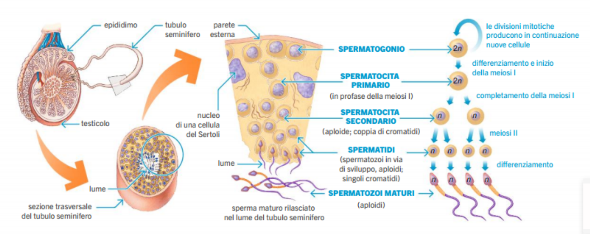
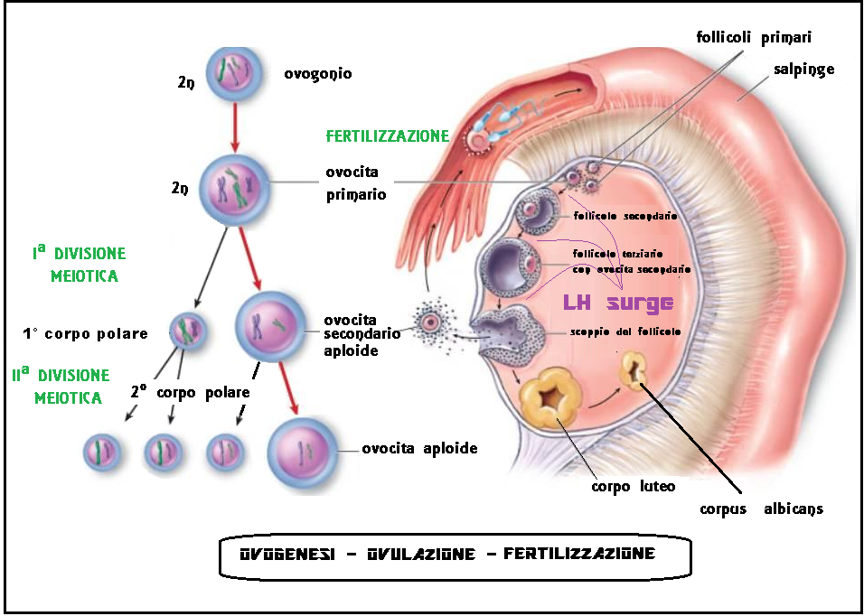

# Biologia

(pag 300 libro nuovo)

Le **gonadi** (testicoli-m, ovaie-f) producono i **gameti** (spermatozoi-m, ovuli-f)/semi all'interno dei **tubi seminiferi**.

## Spermatogenesi

La creazione dei spermatozoi avviene all'interni dei tubi seminiferi. Successivamente si spostano nell'**epididimo**, per completare la maturazione.

## Ovogenesi

(più complicato)

Numero prestabilito di potenziali cellule uovo. Le cellule diploidi delle femmine, sono già in meiosi.

Nella meiosi I, viene presa solo una delle due cellule (ed hanno anche grandezze diverse), e quest'ultima **non inizia la meiosi II** se non avviene la fecondazione della stessa cellula.
