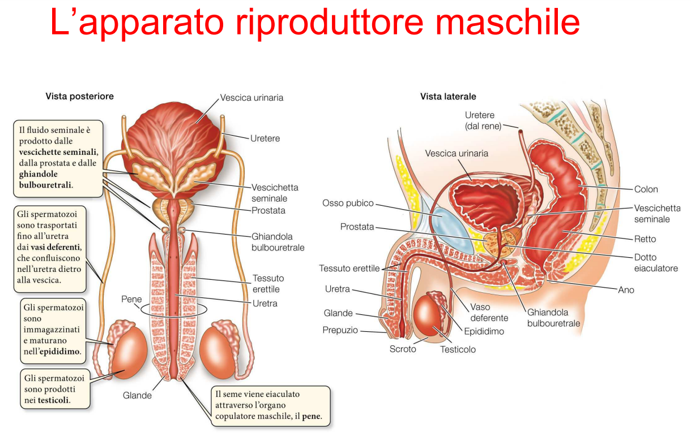
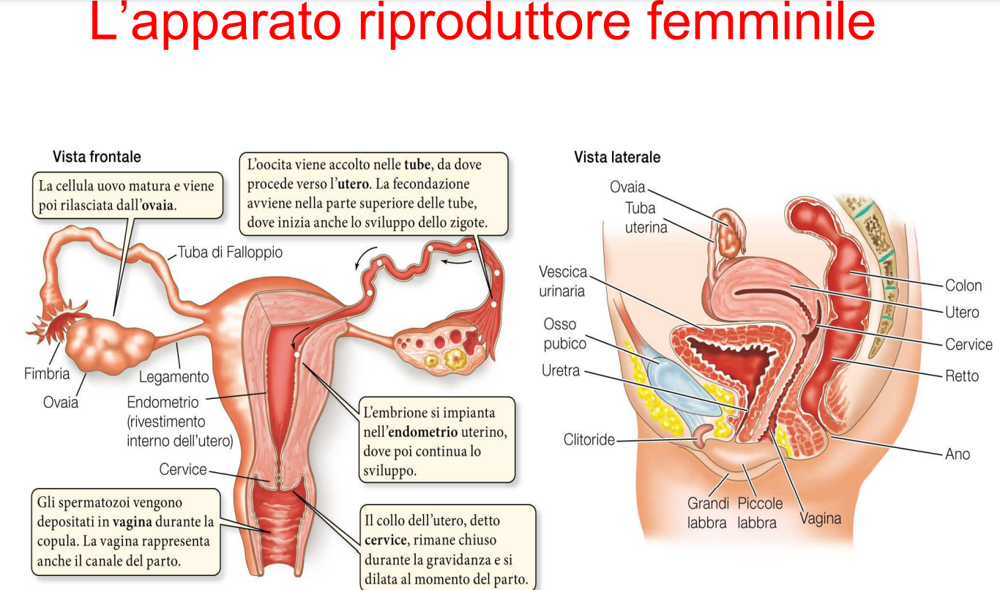

# Biologia

Ormoni importanti per far avvenire i processi di produzione. Nei maschi è importante l'uso di **testosterone**. Anche le femmine ne producono, ma in quantità inferiore.

[doc apparato riproduttore](https://liceocuneo.it/oreggia/wp-content/uploads/sites/14/Sistema-riproduttore.pdf)

## Apparato riproduttore maschile

- **uretra**: l'urina e lo sperma passano all'interno dello stesso canale
- Il **pene** sta a riposo quando non serve, per non sprecare energie.
- Lo **scroto** è la sacca che contiene i testicoli.
- Gli spermatozoi necessitano di un liquido per soppravvivere.
  - prodotto dalla **vescichetta seminale**.
- Gli spermatozoi sono particolarmente **basici**.
- Il **Vaso deferenze** porta gli spermatozoi nella vescichetta seminale.
- Dopo che si è creato lo **sperma** (unione spermatozoi e liquido per farli vivere), viene contenuto nella **prostata**.
- **Ghiandole bulbouterali**
- In fase di erezione, i **tessuti erettili** si riempono di sangue (tre fasce) anche chiamati **corpi cavernosi**.
- Il **glande** è la parte finale del pene, ed è coperto dal **prepuzio**. Il glande è ricchissimo di terminazione nervose, il che lo rende **molto sensibile**.

### Controllo ormonale

GnRH = Gonadotropina

## Apparato riproduttore femminile

- **utero** rivestito dall'**endometrio** (mucosa), che serve per impiantare l'embrione
- **tuba di Falloppio/ovidotto**
