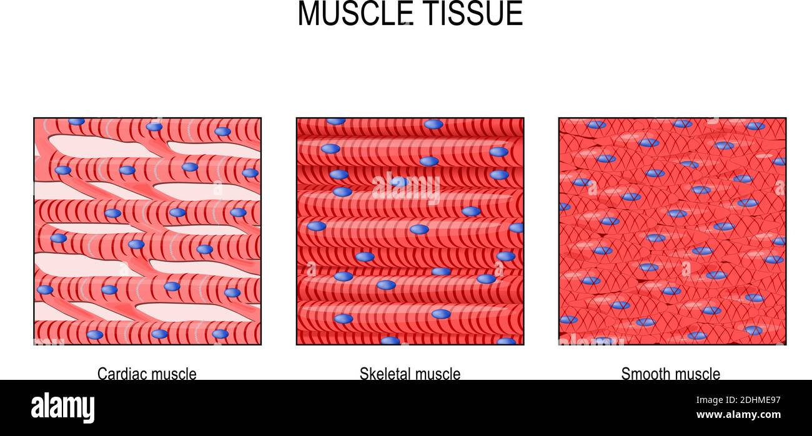
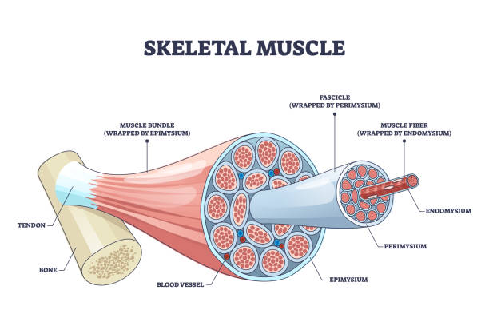
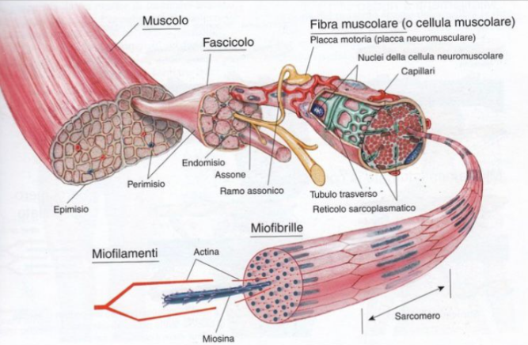
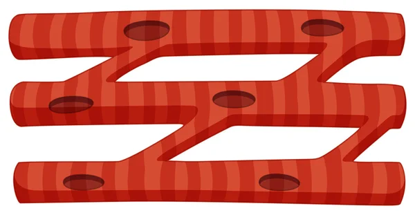
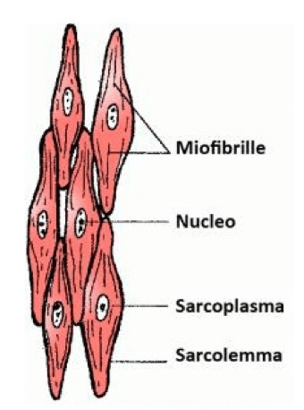

# Biologia
## Tessuto muscolare

3 tipi di tessuti muscolari

### Scheletrici

- muscolo striato collegato allo scheletro attraverso i tendini
- volontario

#### Composizione

- **mioglobina**
  - proteina nei muscoli
  - stessa funzione dell'emoglobina
    - ossigenare le cellule muscolari
    - differenza la sede
      - emoglobina --> globuli rossi
      - mioglobina --> cellule muscolare
- **parenchima**
  - l'insieme delle cellule muscolari contrattili
  - rossa
- **stroma**
  - involucri e tessuti di supporto di natura connettivale
    - terminazione nervose
    - vasi sanguigni
  - bianca
- **involucri connettivali**
  - **epimisio**
    - connettivo denso irregolare
    - avvolge l'intero muscolo
  - **perimisio**
    - setto connettivale
    - connettivo lasso
    - avvolge i **fasci muscolari**
      - cellule molto ravvicinate
  - **endomisio**
    - sottile strato connettivo che separa le cellule muscolari
    - avvolge le **fibre/cellula muscolare/fibrocellula muscolare**

### Cellule muscolari scheletriche/striate

- sezione trasversale: poligonale
- sezione longitudinale: percorre tutto il muscolo
- creazione
  - composto all'inizio di cellule separate
  - successivamente citoplasmi fusi
  - nuclei in periferia della fibra
    - centinaia
  - all'interno del citoplasma struttura proteica che percorre tutta la fibra

#### Composizione interna

- **sarcolemma**
  - stessa funzione della membrana
    - avvolge la cellula
- **miofibrille**
  - striature ripetute in parallelo
    - **sarcomeri**
  - strutture proteiche all'interno della cellula composti da miofilamenti
  - si contrattano e si dilatano a "fisarmonica", grazie a due filamenti diversi:
    - **actina**
    - **miosina**
  - fulcro contrazione --> ione calcio + atp
    - tanta atp per il movimento
      - richiesta di zuccheri

Terminazioni nervose si attaccano alle singole fibre.
- motoneurone segnale che arriva fino alla placca motrice
  - sinapsi
- rilascia acetilcolina nel
  - sarcolemma
  - interno fibra tramire tubuli T

Due tipi diversi di fibre
- fibra di tipo 1 (fibre bianche)
  - diametro piccolo
  - molta mioglobina
  - molti mitocondri --> molta atp
  - lavoro aerobico/resistenza
- fibra di tipo 2 (fibre rosse)
  - diametro grande
  - poca emoglobina
  - pochi mitocondri --> energia da glucosio
    - acido lattico --> fatica
  - lavoro anaerobico/forza

### Cellule muscolari striate-cardiache

- cellule chiamate miocardiociti
- assenza di produzione di acido lattico
  - mitocondri molto sviluppati e potenti
  - è presente un enorme quantità di ATP
- cellule unite attraverso dischi intercalari (giunzioni)
- cellule biforcate
  - non singoli filamenti lunghi
  - ma un cellula che nell'estremite si divide in 4 unendosi con altre cellule muscolari
    - a rete
  - serve per comunicazione tra le cellule
    - coordinazione tra di loro
- non ci sono terminazioni nervose nelle cellule cardiache
  - contrazione involontaria

### Cellule muscolari lisce

- non sono presenti striature
- 4 diverse tonache
  - cellule orientamento diverso
- organizzazione miofibrille a rete
  - non parallele
  - simile alla contrazione delle cellule cardiache
  - uniti attraverso dei punti di ancoraggio
  - contrazione più lenta
- terminazione nervose avvolgono le cellule muscolari lisce.
  - involontario
    - no sinapsi
    - controllo dal sistema nervoso autonomo

