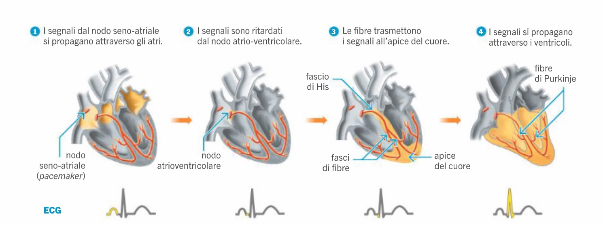

# Biologia
## Apparato cardiovascolare

- Cuore composto in **atri** e **ventricoli**
- Funzione di **pompaggio sangue**
- Si trova nel **mediastino**
  - sotto lo sterno
- formato da 3 strati di tessuto
  - **epicardio**
    - sottile membrana costituita da tessuto epiteliale monostratificato
  - **miocardio**
    - costituito da tessuto muscolare cardiaco
    - genera il movimento del cuore
  - **endocardio**
    - sottile strato di tessuto epiteliale pavimentoso
      - aderisce al tessuto connettivo
    - riveste cavità cardiache/interno del cuore

Cuore diviso in 2 sezioni con due funzioni diverse:
- Parte destra:
  - atrio destro: prende il sangue da tutto il corpo
    - IN vena cava superiore e inferiore
  - valvola tricuspide
  - ventricolo destro: spinge il sangue verso i polmoni
    - OUT arteria polmonare
  - valvola semilunare
    - tra ventricolo e arteria
    - dà il battito
- Parte sinistra:
  - atrio sinistro: prende sangue dai polmoni
    - IN vene polmonari (due che si uniscono)
  - valvola bicuspide/mitrale
  - ventricolo sinistro: spinge il sangue in tutto il corpo
    - OUT aorta
  - valvola semilunare

Sistema pompaggio:
- atrio diastole
  - prende sangue
    - viene portato anche al ventricolo
  - si allarga
  - valvola cuspidale aperta
  - valvola semilunare chiusa
- atrio piccola sistole (sistole atriale)
  - valvola cuspidale si chiude
  - valvola semilunare si apre
- sistole ventricolare
  - porta il sangue nell'arteria
  - valvola cuspidale chiusa
    - per non far ritornare sangue nell'atrio
      - nel caso succede: soffio al cuore
  - valvola semilunare aperta

Circolazione chiusa e doppia:
- circolazione polmonare
- circolazione sistemica

Vasi sanguigni si differenziano per funzione e lume (diametro interno):
- arterie
  - parete spessa
  - lume piccolo
  - prendono il sangue dal cuore
  - gerarchia (in base a circ sangue)
    - arteria
    - arteriola
    - capillari arteriosi
- vene
  - parete sottile
  - lume grande
  - portano il sangue al cuore
  - gerarchia (in base a circ sangue)
    - capillari venosi
    - venule
    - vene

Regolazione corporea della pressione sanguigna
- contrazione/rilassamento muscolatura liscia che circonda le arteriole
- contrazione --> vasocostrizione
- rilassamento --> vasodilatazione
- mantenimento flusso ematico adeguato in base alle richieste dell'organismo
  - es sforzo fisico intenso --> vasodilatazione
    - più ossigeno
  - mantenimento grazie anche a molecole specifiche

### Misurazione informazioni relative alla prestazione del cuore

Misurazione pressione
- si gonfia il manicotto
- si sente un suono
  - pressione necessaria per fermare il sangue
    - valore massimo pressione
- si sgonfia il manicotto
- si sente un altro suono
  - valore minimo pressione

Gittata sistolica (ml/battito)
- quantità di sangue pompata per ogni battito

Frequenza cardiaca (battiti/min)
- numero di battiti al minuto

Gittata cardiaca (L/min)
- quantità di sangue pompata al minuto
- calcolo: gittata sistolica * frequenza cardiaca

Impulso elettrico
- particolari cellule nervose
  - gruppo di cellule nervose modificate presenti direttamente nel cuore
    - non collegate al SNA
- gruppo di queste cellule
  - nodo (n^2)
    - dentro l'atrio --> **nodo seno-atriale**
      - contrazione atriale
    - tra atrio e ventricolo --> **nodo atrioventricolare**
      - ritarda contrazione per il ventricolo, cosicché non si contrae contemporaneamente all'atrio
- si sviluppano in
  - fascio di His
    - parte dal nodo atrioventricolare
    - si dirama in branchia sinistra e destra
  - fasci/fibre di Purkinje
    - abbracciano il ventricolo
    - prosecuzione delle brachie del fascio di His
  - originano/derivano dal SNA (sistema nervoso autonomo)
- agiscono per
  - natura chimica
    - emessi dal SNA
    - adrenalina
  - regolazione omeostatica
    - condizione di equilibrio organismo
    - es troppo O2, CO2, bisogno di C6H12O6

Coronarie
- vasi sanguigni che circondano il miocardio (tessuto muscolare cardiaco, corpo del cuore)
- forniscono nutrimento
  - O2, glucosio

Operazioni al cuore
- peacemaker artificiale
  - supplemento/sostituzione dell'impulso originato dal nodo seno-atriale
- bypass
  - ostruzione completa di una coronaria
    - cellule morte a valle
  - quando angioplastica non basta
    - tubicino con palloncino
      - serve per liberare l'ateroma
  - vaso aggiuntivo dall'aorta
    - per far arrivare il sangue dopo l'ostruzione

