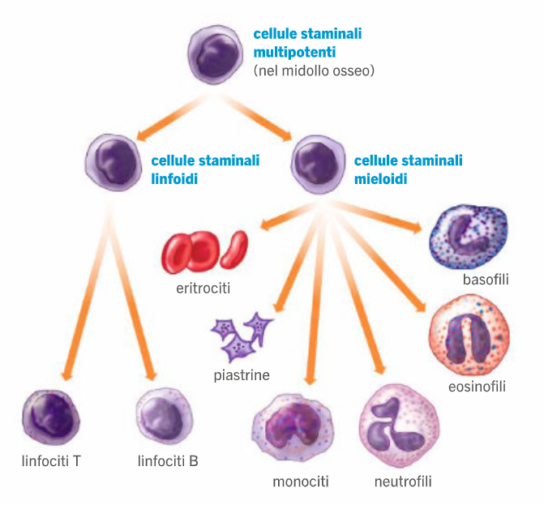

# Biologia
## Sangue

Composizione
- parte corpuscolata
  - globuli rossi (45)
    - trasportano ossigeno
      - no anidride carbonica
        - viaggia nel plasma sotto forma di ioni
          - CO2 + H20 --> H+ + HCO3- (ione triossocarbonato acido)
    - durante la maturazione, perdono il nucleo
      - forma della cellula schiacciata al centro
        - serve per muoversi tra i capillari sanguigni
    - per arricchirsi di emoglobina
      - colore rosso perché ricca di ferro
      - proteina quaternaria da 4 catene uguali due a due
        - all'interno delle catene gruppo eme (4tot)
          - contiene uno ione di ferro che si lega con una molecola di ossigeno
  - globuli biachi e piastrine (<1)
- plasma (55)
  - sostanze nutritive e di scarto

Formazione
- da cellule staminali multipotenti (nel midollo osseo delle ossa piatte)
  - cellule staminali linfoidi
    - si muovono nella linfa
    - tipi
      - linfociti T
        - maturano nel timo
          - ghiandola dietro lo sterno
        - funzione di allerta
      - linfociti B
        - produno gli anticorpi
          - sono proteine (più specifico avanti)
  - cellue staminali mieloidi/emopoitetiche
    - parte corpuscolata del sangue
    - tipi
      - eritrociti/globuli rossi
        - processo eritropoiesi
      - leucociti/globuli bianchi 
        - formula leucocitaria per sapere percentuali
        - vari tipi
          - basofili
          - eosinofili
          - neutrofili
          - monociti
      - piastrine
        - funzione di tamponare le ferite

Diffusione secondo gradiente
- da concentrazione soluti alta a concentrazione soluti bassa

Pressione osmotica
- != pressione sanguigna
  - ps --> verso l'esterno
    - pompaggio sangue
  - po --> verso l'interno
    - differenza di concentrazioni
      - conc solventi più bassa --> (verso) conc solventi più alta
- sangue si muove in base alle differenze tra le due pressioni
- pressione sanguigna generalmente più alta
  - liquido viene perso
    - ripreso dai vasi linfatici
      - liquido --> linfa
    - riemesso in circolo attraverso dotti in grosse vene del collo

    