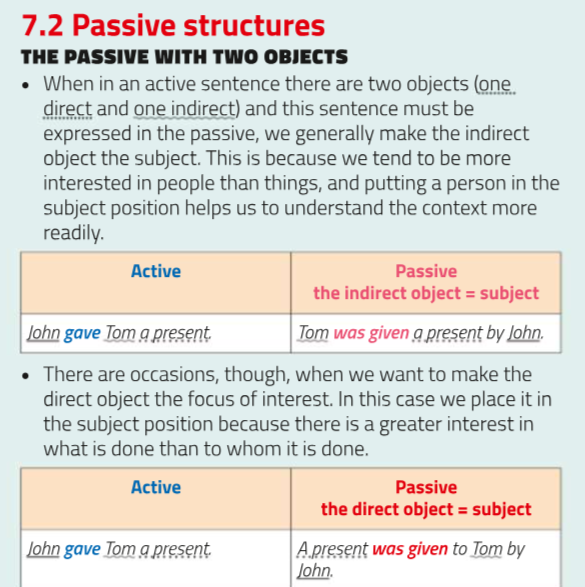

# English
## Passivo particolare

Alcuni casi: complemento oggetto rimane CO, invece è complemento termine diventa soggetto
- chi riceve diventa soggetto della frase
  - es Mi è stata detta una bugia
    - A lie was told to me: nooo
    - I was told a lie: yesssss
- con alcuni verbi: teach, tell, give

