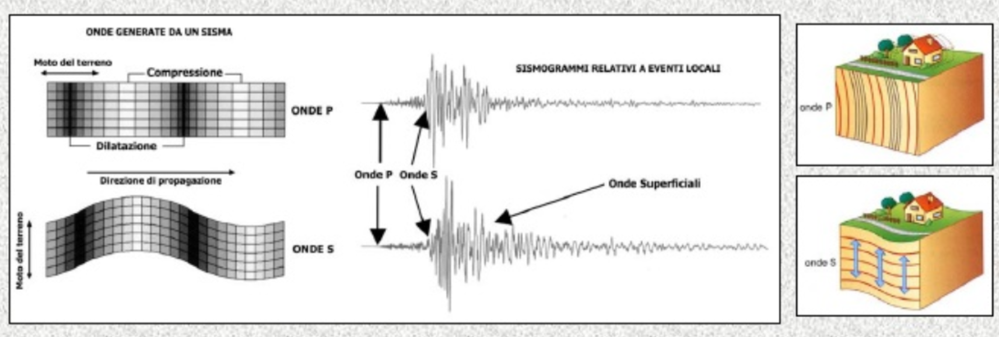
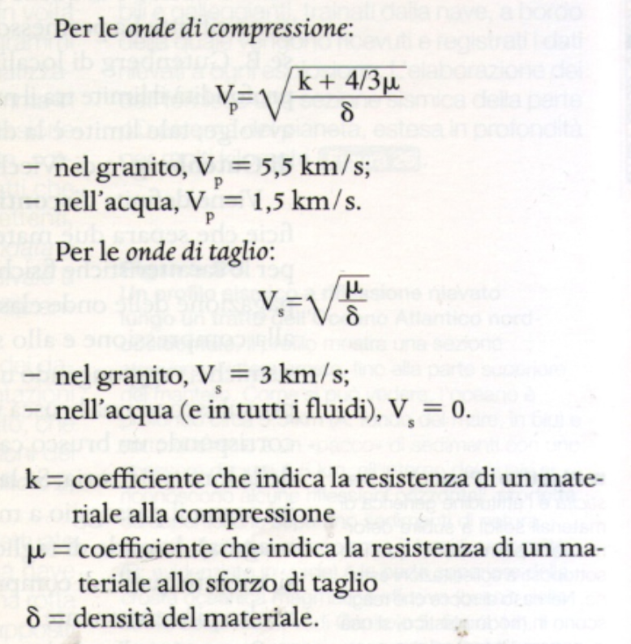
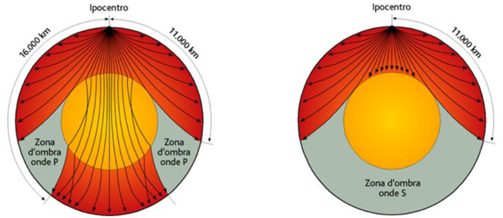
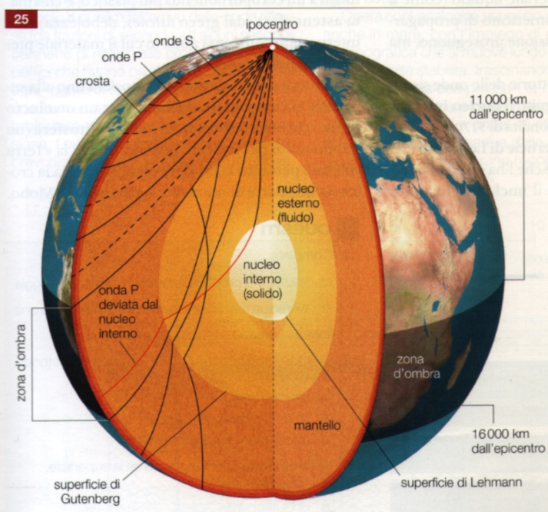

# Scienze della terra
## Dinamica endogena: i terremoti

### Introduzione

- **All'interno della terra processo dinamico non visibile.**
- **Terremoti** sono la **conseguenza**
  - **energia rilasciata dal processo**
  - **movimento repentino/improvviso** all'interno della crosta terrestre
  - All'interno della terra forze che si equilibrano
    - quando si perde l'equilibro (roccia raggiunge limite di rottura), l'energia viene rilasciata
  - (es) Faglia: frattura enorme e slittamento dei blocchi in cui l'energia viene rilasciata sotto forma di **onda sismica**
  - Onda sismica: onda che propaga una vibrazione al terreno a 360 gradi
- Punto liberazione energia: **ipocentro**
- Liberazione di energia in **fronti d'onda**
  - propagazione dell'energia in **più onde** che nel caso dei terremoti sono **sferiche**
- Punto posto sulla verticale dell'ipocentro in superfice si chiama **epicentro**
  - anche punto più vicino della propagazione dell'energia in superfice
- Misurazione:
  - danno: scala **Mercalli**
  - forza: scala **Richter**
- Onde dall'ipocentro 2 tipi:
  - **onda p**:
    - tra 5-14 km/sec
    - attraversano qualunque mezzo (solido, liquido gassoso)
    - onda primaria
    - Veloce
    - Arriva per prima
    - **Onda longitudinale**
      - avanza tramite **compressione e dilatazione** del suolo
        - le sezioni del suolo durante il processo **cambiano forma e volume**
      - **parallelamente alla direzione di avanzamento**
  - **onda s**:
    - tra 3-7 km/sec
    - solo nei solidi
    - onda secondaria
    - Più lenta.
    - Arriva dopo la secondaria
    - **Onda Trasversale**
      - avanza tramite la **mutazione della forma** (non volume) delle sezioni del suolo in perpendicolare
  - Maggiore la distanza dall'ipocentro, maggiore il ritardo della onda s sull'onda p
- Le onde una volta che arrivano in superficie, innescano le **onde superficiali** (pericolose perché fanno danni) di due tipi
  - le **onde di Love**
    - le porzioni di terreno subiscono un azione di "setacciamento" (le particelle si muovono avanti e indietro). 
  - le **onde di Raileigh**
    - le porzioni di terreno subiscono un azione circolare (come le onde del mare)
  - queste onde diminuiscono di intensità con la profondità
- oggetto che registra le onde: **sismografo**
  - prodotto: **sismogramma**
- **ampiezza**: distanza tra la cresta e l'asse x nell'asse y

(domande da fare: numero di onde (cioé solo una primaria e solo una secondaria o di più))

---

### Onde sismiche

#### Onde P e S

- Onde dall'ipocentro 2 tipi:
  - **onda p**:
    - tra 5-14 km/sec
    - attraversano qualunque mezzo (solido, liquido gassoso)
    - onda primaria
    - Veloce
    - Arriva per prima
    - **Onda longitudinale**
      - avanza tramite **compressione e dilatazione** del suolo
        - le sezioni del suolo durante il processo **cambiano forma e volume**
      - **parallelamente alla direzione di avanzamento**
  - **onda s**:
    - tra 3-7 km/sec
    - solo nei solidi
    - onda secondaria
    - Più lenta.
    - Arriva dopo la secondaria
    - **Onda Trasversale**
      - avanza tramite la **mutazione della forma** (non volume) delle sezioni del suolo in perpendicolare
  - Maggiore la distanza dall'ipocentro, maggiore il ritardo della onda s sull'onda p

La formula motiva il fatto che le onde p si propagano anche nei fluidi e nei gas rispetto alle onde s, perché **dipende** anche **da k**.

#### Onde superficiali

- Le onde una volta che arrivano in superficie, innescano le **onde superficiali** (pericolose perché fanno danni) di due tipi
  - le **onde di Love**
    - le porzioni di terreno subiscono un azione di "setacciamento" (le particelle si muovono avanti e indietro). 
  - le **onde di Raileigh**
    - le porzioni di terreno subiscono un azione circolare (come le onde del mare)
  - queste onde diminuiscono di intensità con la profondità
- oggetto che registra le onde: **sismografo**
  - prodotto: **sismogramma**
- **ampiezza**: distanza tra la cresta e l'asse x nell'asse y

---

### Propagazione onde nella terra

- Linee non rette, perché gli **strati della terra non sono omogenei**.
  - dovuta da struttura chimico/minearologica e temperatura/pressioni diverse
  - **propagazione curvilinea**
    - processi di **riflessione e rifrazione** (luce ma applicato alle rocce)
      - l'onda subisce una serie di rifrazioni che causano una **serie di cambi di direzione** che comportano una propagazione dell'onda a forma curvilinea
- da 11000 km non si registra il terremoto
  - **zona d'ombra**
  - le onde s non passano oltre il nucleo esterno
  - le onde p subiscono un alta rifrazione (in entrata e uscita dal nucleo)
    - le onde p non arrivano in superfice tra 11000 e 16000 km
- da 16000 km si registra di nuovo ma solo le onde p

- **Superfice di Gutenberg**
  - tra **mantello inferiore e nucleo esterno**
  - **azzeramento del mu** (lettera greca)
    - diminuisce la velocità onde p
    - onde s si fermano
  - **discontinuità di Gutemberg**
    - **2900 km**
- **Discontinuità di Moho** (Mohorovicic)
  - tra **crosta e mantello**
  - ordine dei **100 km** (in giù)
- **Discontinuità di Lehmann** (donna)
  - tra **nucleo esterno e interno**
  - non cambia al livello dei materiali, ma nel magnetismo
    - il nucleo esterno produce il campo magnetico

---

### Scale di misura

- **Scala Mercalli**
  - scala che misura il danno causato dal terremoto
  - soggettiva

- **Scala Richter**
  - scala che misura la quantità di energia liberata dal terremoto
  - oggettiva
  - utilizza una **scala logaritmica** (magnitudo)
    - formula: log di 10 * (A (massima per il terremoto sconosciuto)/ A0 (massima per il terremoto standard))
    - potenze di 10 (si cambiano per ogni magnitudo)
  - al di sopra di 9,2/3 non si può andare
    - perché, secondo i dati che abbiamo, le rocce hanno un limite per la pressione/temperatura e altro

---

## Sismogramma

- per determinare epicentro
  1. tempo di ritardo onde S
  2. si paragona con il grafico tempo e spazio
  3. misurazione con 3 stazioni
      - intersezioni con le 3 circonferenze

---

## Rischio sismico

Definizione
- prodotto di 3 fattori
  - pericolosità (terremoti)
  - vulnerabilità (edifici vulnerabili)
  - esposizione (popolazione)
- vale per ogni tipo di rischio

---

Recap:
- terremoti --> discontinuità
- discontinuità di Gutemberg in su
- composizione chimica
- silicati
  - SiAL/SiMa
  - ione silicato di...
- SiO4(4-)
  - tetraedro
    - cella elementale
  - 4 facce
  - piramide a base triangolare
  - poliedro
    - angolo volumico
- quarzo o silice
  - solo silicio, ma conta cambia
    - ossigeni in comune
  - rapp 1:2
    - da uno a due 2:7 da due a tre 3:10...
    - se si prosegue, si raggiunge rapp 1:2
  - --> SiO2
- ione silicato non solo uniti tra di loro, ma anche con i metalli
  - es plagioclasio
